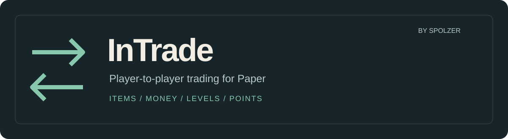

<div align="center">



Items, money, levels and points. One trade window, two confirmations.


[](LICENSE)

<a href="#english"> English</a> · <a href="#russian"> Русский</a>

</div>

<a id="english"></a>

##  English

InTrade is a server plugin for trading directly with another player. Your offer is on the left, theirs is on the right. Each side has 16 item slots and controls for the available currencies. No client mod is needed.

### Make a trade

1. Send `/trade <player>`, or sneak and right-click them. They accept with `/trade accept`.
2. Add your items: left-click for a stack, right-click for one item. Click an offered item to take it back.
3. Select a currency and enter an amount. Inputs such as `1500`, `2.5k` and `1m` are accepted.
4. Check the other offer and press **Ready**. The trade completes after both players confirm and the countdown ends.

Changing an offer clears both confirmations. By default, Ready is locked for **3 seconds**, changed items are highlighted for **6 seconds**, and the final countdown lasts **3 seconds**. Removed items leave a red marker. You can also inspect the contents of the other player's shulker boxes and bundles.

### Install

Put `InTrade-1.0.0.jar` in the server's `plugins` directory and restart. The first start creates `plugins/InTrade/config.yml`, language files and a local SQLite database.

The plugin compiles against **Paper 1.21.7** with Java 21 bytecode. Use the Java version required by your Paper server; newer server versions may require a newer JDK. The build additionally checks compilation against **Paper 26.3 build 34 alpha**. That is an API compatibility check, not a claim that every server version has been tested in-game.

| Optional plugin | Adds |
| --- | --- |
| Vault + an economy provider | Money in the trade window |
| PlayerPoints | Points in the trade window |
| Floodgate | Native amount-entry forms for Bedrock players |
| PlaceholderAPI | Trade statistics and player-state placeholders |

Items and whole experience levels work without these integrations. Paper downloads the libraries declared in `plugin.yml` on first start, so the server needs internet access then.

### Commands

| Command | Action |
| --- | --- |
| `/trade <player>` | Send a request, or accept that player's incoming request |
| `/trade accept [player]` | Accept a request |
| `/trade deny [player]` | Decline a request |
| `/trade toggle` | Enable or disable incoming requests |
| `/trade claim` | Collect items held for you |
| `/trade history [player]` | Browse your history; staff can inspect another player's history |
| `/trade reload` | Reload configuration and language files |

`/intrade` is an alias for `/trade`. Requests expire after 60 seconds and have a 5-second cooldown by default.

### Configure your server

[config.yml](plugin/src/main/resources/config.yml) contains all settings and comments. You can restrict distance and worlds, block materials, disable currencies and adjust confirmation timings.

With `language: auto`, messages and menus follow each player's game language. English and Russian are included. Set `language: en` or `language: ru` for one shared language; add translations in `lang/<code>.yml`. `default-language` controls the fallback.

<details>
<summary><strong>Permissions and rank-based access</strong></summary>

| Permission | Default | Access |
| --- | --- | --- |
| `intrade.player` | everyone | All player permissions |
| `intrade.use` | everyone | Requests and `/trade claim` |
| `intrade.sneak` | everyone | Sneak + right-click requests |
| `intrade.toggle` | everyone | Request toggle |
| `intrade.history` | everyone | Own history |
| `intrade.currency.money` | everyone | Vault money |
| `intrade.currency.experience` | everyone | Experience levels |
| `intrade.currency.playerpoints` | everyone | PlayerPoints |
| `intrade.admin` | op | All staff permissions |
| `intrade.history.others` | op | Other players' history |
| `intrade.reload` | op | Configuration reload |
| `intrade.bypass.distance` | op | Ignore distance and world restrictions |
| `intrade.bypass.cooldown` | op | Ignore request cooldown |
| `intrade.bypass.blocked` | op | Trade blocked materials |

Wildcards: `intrade.*`, `intrade.currency.*`, `intrade.bypass.*`. Defaults are defined in [plugin.yml](plugin/src/main/resources/plugin.yml); LuckPerms does not list them as explicit group assignments until you set them.

To allow trading only from a specific rank, set:

```yaml
permissions:
  open-to-everyone: false
```

Run `/trade reload`, then grant the rank access:

```text
/lp group rank3 permission set intrade.player true
```

Higher ranks inherit access if your LuckPerms group hierarchy is configured that way. Individual currencies can be restricted separately:

```text
/lp group rank3 permission set intrade.currency.money false
/lp group rank5 permission set intrade.currency.money true
```

Players without `intrade.use` cannot receive requests. Staff permissions remain operator-only by default in either mode; `intrade.history.others` does not require `intrade.history`.

</details>

<details>
<summary><strong>History, storage and item recovery</strong></summary>

Completed trades can be browsed with their items and currencies. History is kept for **90 days** by default; cleanup runs at startup. Set `history.keep-days: 0` to keep it indefinitely. Trade counts and the leaderboard are stored separately and survive history cleanup.

SQLite stores data in `plugins/InTrade/trades.db`. For MySQL or MariaDB, set `storage.type: mysql`, fill in `storage.mysql` and restart. Tables are created automatically with the `intrade_` prefix.

Several servers can share history and statistics through one database. Give each server a unique `storage.server-id`: pending items and claim mail belong to that server. Older Minecraft versions cannot decode items saved by newer versions; those history entries can appear without their items.

A trade checks both players' free inventory space before completing. Returned items that do not fit, and items held when a participant dies, are saved for `/trade claim`. Pending offers are recorded for recovery after interrupted trades. Player saves, database writes and external economy operations do not share one atomic transaction; recovery is not an absolute guarantee against item or currency loss during an abrupt crash.

</details>

### Placeholders and API

PlaceholderAPI: `%intrade_trades%`, `%intrade_trading%`, `%intrade_accepting%`, `%intrade_top_<1-10>_name%`, `%intrade_top_<1-10>_trades%`.

The [`api` module](api/src/main/java/me/spolzer/intrade/api) exposes statistics and trade events. Use its JAR as a `compileOnly` dependency and declare InTrade in your plugin's `depend` or `softdepend`. Call the service only after InTrade is enabled.

```java
import me.spolzer.intrade.api.InTrade;

InTrade trade = InTrade.get();
trade.tradeCount(player.getUniqueId()).thenAccept(count ->
    getLogger().info("Completed trades: " + count));
```

`TradeRequestEvent` and `TradeStartEvent` are cancellable. `TradeCompleteEvent` includes both offers; `TradeCancelEvent` provides the reason. Statistics return `CompletableFuture` values; schedule work on the server thread before accessing Bukkit objects from a completion callback.

### Build

Install **JDK 25** for the complete build, including the newer API check.

```sh
./gradlew build
```

Windows PowerShell:

```powershell
.\gradlew.bat build
```

Installable plugin: `plugin/build/libs/InTrade-1.0.0.jar`. Developer API: `api/build/libs/api-1.0.0.jar`. The API JAR is not a standalone plugin.

---

<a id="russian"></a>

##  Русский

InTrade — серверный плагин для обмена между игроками. Слева твоё предложение, справа — предложение второго игрока. У каждого по 16 слотов для предметов и кнопки доступных валют. Устанавливать мод на клиент не нужно.

### Как обмениваться

1. Напиши `/trade <игрок>` или нажми по игроку ПКМ, удерживая Shift. Он принимает запрос командой `/trade accept`.
2. Добавь предметы: ЛКМ переносит стак, ПКМ — один предмет. Забрать своё предложение можно теми же кнопками.
3. Выбери валюту и введи сумму. Поддерживаются записи `1500`, `2.5k`, `1m`.
4. Проверь предложение и нажми **Готов**. Когда оба участника подтвердят обмен, начнётся обратный отсчёт.

Любое изменение предложения сбрасывает готовность обоих игроков. По умолчанию кнопка блокируется на **3 секунды**, изменения подсвечиваются **6 секунд**, а финальный отсчёт длится **3 секунды**. На месте убранного предмета появляется красная отметка. Содержимое шалкеров и мешков второго игрока можно посмотреть до обмена.

### Установка

Положи `InTrade-1.0.0.jar` в папку `plugins` сервера и перезапусти его. При первом запуске появятся `plugins/InTrade/config.yml`, языковые файлы и база SQLite.

Плагин собирается на **Paper API 1.21.7** в байткод Java 21. Версию Java выбирай по требованиям своего Paper: новым версиям сервера может требоваться более новый JDK. Сборка дополнительно проверяет компиляцию с **Paper 26.3 build 34 alpha**. Это проверка совместимости API; она не означает, что каждую версию сервера проверяли в игре.

| Необязательный плагин | Что добавляет |
| --- | --- |
| Vault + плагин экономики | Деньги в окне обмена |
| PlayerPoints | Обмен поинтами |
| Floodgate | Нативную форму ввода суммы для Bedrock-игроков |
| PlaceholderAPI | Плейсхолдеры статистики и состояния игрока |

Предметы и целые уровни опыта доступны без интеграций. При первом запуске Paper скачивает библиотеки из `plugin.yml`; для этого нужен доступ к интернету.

### Команды

| Команда | Действие |
| --- | --- |
| `/trade <игрок>` | Отправить запрос или принять входящий от этого игрока |
| `/trade accept [игрок]` | Принять запрос |
| `/trade deny [игрок]` | Отклонить запрос |
| `/trade toggle` | Включить или выключить входящие запросы |
| `/trade claim` | Забрать сохранённые для тебя предметы |
| `/trade history [игрок]` | Своя история; для администрации — история другого игрока |
| `/trade reload` | Перечитать конфигурацию и переводы |

Вместо `/trade` можно писать `/intrade`. По умолчанию запрос действует 60 секунд, задержка между запросами — 5 секунд.

### Настройка

Все параметры с комментариями находятся в [config.yml](plugin/src/main/resources/config.yml). Можно ограничить расстояние и миры, запретить материалы, отключить валюты и изменить задержки подтверждения.

При `language: auto` каждый игрок видит сообщения и меню на языке своего Minecraft. В комплекте русский и английский. `language: ru` или `language: en` задаёт единый язык, `default-language` — запасной. Новые переводы добавляются в `lang/<код>.yml`.

<details>
<summary><strong>Права и доступ по рангам</strong></summary>

| Право | По умолчанию | Доступ |
| --- | --- | --- |
| `intrade.player` | все | Все права игрока |
| `intrade.use` | все | Запросы и `/trade claim` |
| `intrade.sneak` | все | Запрос через Shift + ПКМ |
| `intrade.toggle` | все | Переключение входящих запросов |
| `intrade.history` | все | Своя история |
| `intrade.currency.money` | все | Деньги Vault |
| `intrade.currency.experience` | все | Уровни опыта |
| `intrade.currency.playerpoints` | все | Поинты PlayerPoints |
| `intrade.admin` | op | Все права администрации |
| `intrade.history.others` | op | Чужая история |
| `intrade.reload` | op | Перезагрузка настроек |
| `intrade.bypass.distance` | op | Обход ограничений расстояния и миров |
| `intrade.bypass.cooldown` | op | Обход задержки запросов |
| `intrade.bypass.blocked` | op | Обмен запрещёнными материалами |

Общие узлы: `intrade.*`, `intrade.currency.*`, `intrade.bypass.*`. Значения по умолчанию заданы в [plugin.yml](plugin/src/main/resources/plugin.yml). В редакторе LuckPerms они не появляются как явно выданные права, пока ты не назначишь их группе.

Для обмена с определённого ранга укажи:

```yaml
permissions:
  open-to-everyone: false
```

Выполни `/trade reload` и выдай доступ нужной группе:

```text
/lp group rank3 permission set intrade.player true
```

Следующие ранги получат доступ, если у тебя настроено наследование групп. Например, обмен доступен с третьего ранга, а деньги — только с пятого:

```text
/lp group rank3 permission set intrade.currency.money false
/lp group rank5 permission set intrade.currency.money true
```

Без `intrade.use` игрок не может получать запросы. Административные права в обоих режимах по умолчанию доступны только операторам. Для `intrade.history.others` не требуется `intrade.history`.

</details>

<details>
<summary><strong>История, база данных и возврат предметов</strong></summary>

В истории видны предметы и валюты завершённых обменов. По умолчанию записи хранятся **90 дней**, очистка выполняется при запуске. `history.keep-days: 0` отключает удаление старых записей. Счётчики обменов и топ хранятся отдельно и не сбрасываются при очистке истории.

SQLite работает без настройки: база находится в `plugins/InTrade/trades.db`. Для MySQL или MariaDB установи `storage.type: mysql`, заполни `storage.mysql` и перезапусти сервер. Таблицы с префиксом `intrade_` создаются автоматически.

Несколько серверов могут использовать общую историю и статистику в одной базе. Каждому нужен уникальный `storage.server-id`: незавершённые предложения и предметы для `/trade claim` привязаны к серверу. Старая версия Minecraft не умеет читать предметы, сохранённые новой; такие записи истории могут отображаться без предметов.

Перед завершением обмена проверяется место в инвентарях. Предметы, которые не поместились при возврате, и предметы умершего участника сохраняются для `/trade claim`. Незавершённые предложения записываются в базу для восстановления. Файл игрока, база и сторонняя экономика не объединены в одну транзакцию: абсолютной гарантии сохранности при аварийном завершении сервера нет.

</details>

### Плейсхолдеры и API

PlaceholderAPI: `%intrade_trades%`, `%intrade_trading%`, `%intrade_accepting%`, `%intrade_top_<1-10>_name%`, `%intrade_top_<1-10>_trades%`.

Модуль [`api`](api/src/main/java/me/spolzer/intrade/api) предоставляет статистику и события. Подключи его JAR как `compileOnly`, добавь InTrade в `depend` или `softdepend` своего плагина и обращайся к сервису после включения InTrade. [Пример Java](#placeholders-and-api).

`TradeRequestEvent` и `TradeStartEvent` можно отменить. `TradeCompleteEvent` содержит оба предложения, `TradeCancelEvent` — причину отмены. Статистика возвращается через `CompletableFuture`; для работы с Bukkit из обработчика результата переключайся на основной поток сервера.

### Сборка

Для полной сборки с проверкой нового API нужен **JDK 25**.

```powershell
.\gradlew.bat build
```

Linux и macOS: `./gradlew build`.

Плагин для сервера: `plugin/build/libs/InTrade-1.0.0.jar`. API для разработчиков: `api/build/libs/api-1.0.0.jar`. API JAR не является отдельным плагином.

---

<div align="center">

**Spolzer** · InTrade · [MIT License / Лицензия MIT](LICENSE)

<a href="#english"> English</a> · <a href="#russian"> Русский</a>

</div>
